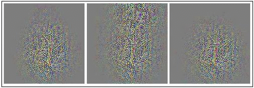

# HGO-CNN: Hybrid Generic-Organ Convolutional Neural Network For Multi-Organ Plant Classification

Released Oct 09, 2017.

## Description

This is the implementation of our ICIP2017 work with titled -- [HGO-CNN: Hybrid generic-organ convolutional neural network for multi-organ plant classification](http://cs-chan.com/doc/ICIP_CR.pdf).

 

## Citation 
If you find this code useful for your research, please cite:
```sh
@inproceedings{lee2017hgo,
  title={Hgo-cnn: Hybrid generic-organ convolutional neural network for multi-organ plant classification},
  author={Lee, Sue Han and Chang, Yang Loong and Chan, Chee Seng and Remagnino, Paolo},
  year={2017},
  organization={ICIP}
}
```

## Dependency

* The codes are based on [caffe](http://caffe.berkeleyvision.org/)

## Dataset
* The [PlantClef2015 dataset](http://www.imageclef.org/lifeclef/2015/plant) used has 1000 plant species classes. 
* Training and testing data comprises 91759 and 21446 images respectively. Each image is associated with single organ type (branch, entire, flower, fruit, leaf, stem or leaf scan).

## Installation and Running

1. Users are required to install [Caffe](https://github.com/BVLC/caffe) Library.

2. Users are required to download the aforementioned datasets for a fair comparison to our proposed models.

3. Please follows the following step-by-step training strategy to train a HGO-CNN:

    1. A two path CNN is first pre-trained using the ImageNet challenge dataset. New model can be trained via ```train_caffenet.sh``` which can be found in the ```models/two-path_CNN```  and the ready trained caffemodel can be downloaded from ```models_HGO/two-path_CNN/multi_path_vgg_imagenet_iter_426094.caffemodel```.
  
    2. After pre-trained, one of the CNN path is repurposed to train on the *organ* task. New organ model can be trained via ```train_caffenet.sh``` which can be found in the ```models/model_organ``` and the ready trained caffemodel can be downloaded from ```models_HGO/model_organ/PlantClef_vgg_organ_iter_89229.caffemodel```.

    3. After training the organ layer, another CNN path is repurposed for the *generic* task. New generic model can be trained via ```train_caffenet.sh``` which can be found in the ```models/model_generic``` and the ready trained caffemodel can be downloaded from ```models_HGO/model_generic/PlantClef_vgg_species__iter_200000.caffemodel```.

   4. Finally, both the organ and generic components are combined to train the *species* layer. New species model can be trained via ```train_caffenet.sh``` which can be found in the ```models/model_species``` and the ready trained caffemodel can be downloaded from ```models_HGO/model_species/PlantClef_vgg_species_organ_iter_524332.caffemodel```.
   
   **Note that users are expected to modify the corresponding files to correct path to work properly.

4. After obtaining the HGO-CNN model, softmax probabilities of testing images can be extracted via ```prob_ext.py```.

5. The probability values extrated can be evaluated via the two evaluation metrics mentioned in the ```matlab``` folder.

## Feedback
Suggestions and opinions of this work (both positive and negative) are greatly welcome. Please contact the authors by sending email to ``` adeline87lee at gmail.com ``` and `cs.chan at um.edu.my` 

## Lisense
The project is open source under BSD-3 license (see the ``` LICENSE ``` file). Codes can be used freely only for academic purpose.


